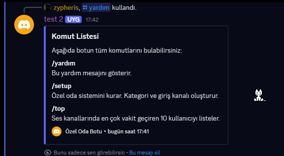
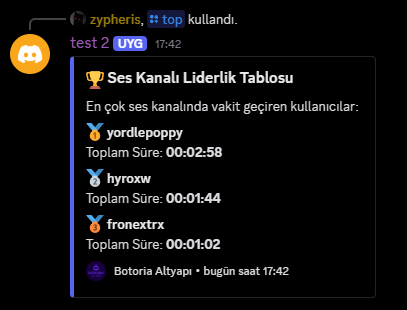
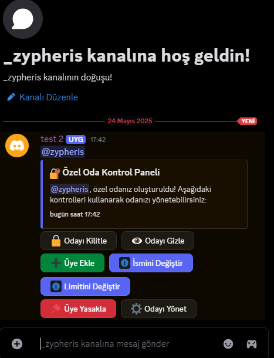

# Discord.js v14 Ticket Bot

Bu bot Discord.js v14 kullanılarak geliştirilmiş bir ticket (destek talebi) botudur. Slash komutlar kullanarak kurulum yapabilir ve talep sistemini yönetebilirsiniz.

## Özellikler

- `/setup` komutu ile log kanalı ve yetkili rolü belirleme
- `/ticket` komutu ile istediğiniz kanala talep oluşturma mesajı gönderme
- Ticket oluşturma, yönetme ve kapatma sistemi
- Talep kapatıldığında transcript oluşturma
- Sesli destek kanalı oluşturma
- Taleplere üye ekleme özelliği
- Aktif talep sayısını gösteren dinamik kategori adı


## Komutlar Görselleriyle

**Yardım**


  


**top**


  

**Panel**

  

## Kurulum

1. `config.json` dosyasını düzenleyin:
   - `token`: Discord bot token'ınızı ekleyin
   - `clientId`: Bot kullanıcı ID'nizi ekleyin

2. Bağımlılıkları yükleyin:
   ```
   npm install
   ```

3. Slash komutları kaydedin:
   ```
   node deploy-commands.js
   ```

4. Botu başlatın:
   ```
   node index.js
   ```

## Kullanım

1. `/setup` komutunu kullanarak log kanalı ve yetkili rolünü ayarlayın
2. `/ticket` komutunu kullanarak ticket mesajının gönderileceği kanalı seçin
3. Kullanıcılar "Destek talebi oluştur" butonuna tıklayarak ticket oluşturabilirler
4. Destek talebi mesajını istediğiniz gibi değiştirebilirsiniz Lütfen inceleyin

## Teknik Detaylar

- Discord.js v14 kullanılmıştır
- croxydb veritabanı kullanılmıştır
- discord-html-transcripts paketi ile Log kaydı yapılmıştır
